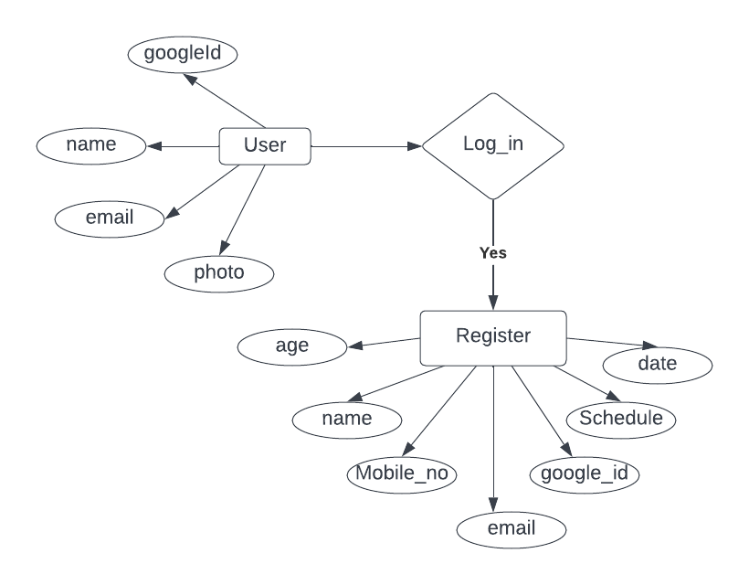

**<p align="center"> Yoga App</p>**
<!-- **<a align="center" href="https://dbms2704.herokuapp.com/"> 
#HIREBOOK
</a>** -->


# Table of Contents
- [Work flow](#struc)
- [Technologies used](#Tech)
- [ER-Diagram](#ER)
- [Run](#run)

<a name="struc"></a>
# Work flow


<a name="Tech"></a>
# Technologies Used
- MongoDB(Backend)
- Nodejs(Backend)
- React js
- Redux
- Google-o-auth
- React-bootstrap
- Express.js

<a name="Er"></a>
# ER Diagram

<a name="run"></a>
# How to run the code

```
Open the Source code folder and open hire book code in your editor and 
$ npm i
$ npm run dev ..
Open localhost:3000 and to find the magic

```

