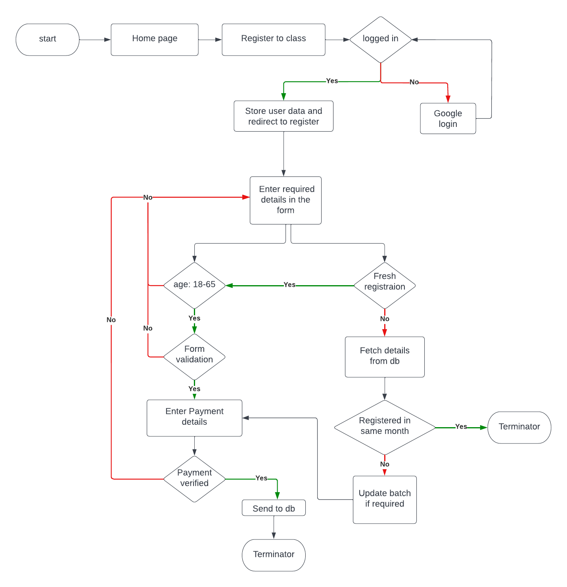

**<p align="center"> Yoga App</p>**
<!-- **<a align="center" href="https://dbms2704.herokuapp.com/"> 
#HIREBOOK
</a>** -->


# Table of Contents
- [Work flow](#struc)
- [Technologies used](#Tech)
- [ER-Diagram](#ER)
- [Run](#run)
- 

<a name="struc"></a>
#Work flow



<a name="run"></a>
#How to run the code

```
Open the Source code folder and open hire book code in your editor and 
$ npm i
$ npm run dev ..
Open localhost:3000 and to find the magic

```
<a name="pre"></a>
# Technologies Used
- MongoDB(Backend)
- Nodejs(Backend)
- JS(Backend)
- Bcrypt js(Backend)
- Passport js (Backend)
- Express JS(frontend)
- React JS(frontend)
- HTML(frontend)
- CSS(frontend)
- Bootstrap V.5(frontend)
- Heroku(Deploy)
- Netlify(Deploy)


<a name="pre"></a>
# CODE
Best to see in 67% 

